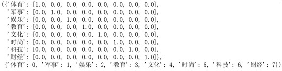
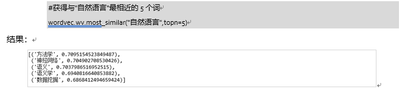

## 实验5 词向量

#### 1.One-hot编码实验

##### 1.1 实验介绍

One-hot编码也称之为独热编码，是NLP里的经常在预处理数据的时候使用的技术。通常是需要将离散型特征或者标签用One-hot编码。比如房价预测中，出现房屋朝向的特征，一共有南、东南、西南、东、东北、北、西北和西8个方向，那么这样的离散特征是需要One-hot编码的，比如“南”的one-hot编码为[1,0,0,0,0,0,0,0]，“东南”的One-hot编码为[0,1,0,0,0,0,0,0]…依此类推。

#### 1.2 实验要求

```python
x=['体育', '军事', '娱乐', '教育', '文化', '时尚', '科技', '财经']
onehot_encode(x)
```

编写onehot_encode函数，生成效果如下：



**提示**：可以使用sklearn.preprocessing中的OneHotEncoder

##### 1.3 思考题

从one-hot编码结果来看，one-hot编码的缺点是什么？


#### 2.Word2vec词向量训练

Word2vec是Google在2013年开源的一款用于词向量计算的工具，一经发布就引起了工业界和学术界的关注。首先，Word2vec可以在百万数量级的词典和上亿的数据集上进行高效地训练；其次，该工具训练得到的词向量（word embedding），可以很好地度量词与词之间的相似性。Word2vec不是一种深度学习算法，其后面只是一个浅层神经网络，包含两种模型：CBOW模型和Skip-gram模型。

本实验主要是基于Python和gensim框架实现Word2vec在Wikipedia语料集上面的应用，并且获取词的词向量以及寻找相近词。

##### 2.1 数据集


数据来源于维基语料

数据链接：https://icloud.qd.sdu.edu.cn:7777/link/28AA675BD5725B6D09B317234579B273
有效期限：2021-05-20

共计33w条数据，数据太大，可以取10w条（或5w，数据量太小容易导致训练结果不佳）进行实验。

```python
#数据处理部分
from gensim.corpora import WikiCorpus
from gensim.models import word2vec
import zhconv #繁体字简体字转换
import jieba
import re
import multiprocessing
input_file_name = 'zhwiki-latest-pages-articles.xml.bz2'
output_file_name = 'corpus_cn.txt'
#加载数据
input_file = WikiCorpus(input_file_name, lemmatize=False, dictionary={})
#将lemmatize设置为False的主要目的是不使用pattern模块来进行英文单词的词干化处理，无论你的电脑#是否已经安装了pattern，因为使用pattern会严重影响这个处理过程，变得很慢
with open(output_file_name, 'w', encoding="utf8") as output_file:
#使用WikiCorpus类中的get_texts()方法读取文件，每篇文章转换为一行文本，并去掉标签符号等内容
    count = 0
    for text in input_file.get_texts():
        output_file.write(' '.join(text) + '\n')
        count = count + 1
        if count % 10000 == 0:
            print('已处理%d条数据' % count)            
    print('处理完成！')
    
#查看处理结果
with open('corpus_cn.txt',"r",encoding="utf8") as f:
    print(f.readlines()[:1])
```

##### 2.2 基本步骤

1. **预处理**：包括繁体->简体转换，分词，去除非中文词等主要步骤。

2. **训练词向量**：使用gensim训练并保存model。
3. **加载模型并测试效果**：如查看词汇的词向量，获取与某词汇最相关的n个词。

例如：